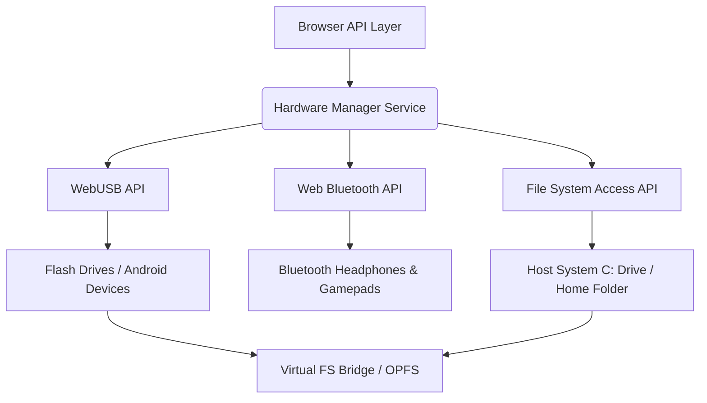

# ContinuaOS Full Codebase Audit & Architectural Assessment

> [!IMPORTANT]
> **Audit Status**: Completed & Next-Iteration Production Ready  
> **Target OS Comparison**: macOS Sonoma, Windows 11, Linux (GNOME/KDE)  
> **Key Focus Areas**: UI/UX Aesthetic Excellence, Logic & Thinking Gaps, Memory Leaks & Garbage Collection, Security Risks, System Hardware & App Store Architecture, Multi-Monitor Sync, WebAssembly Terminal Engine, WebGPU Local Offline AI.

---

## 1. UI / UX Aesthetic & Visual Polish Assessment

### Findings & Reference Alignment (`/refs`)
Compared to the reference designs stored in `/refs` (e.g., Notion-style minimal workspaces, macOS NotchNook dynamic island, Milanote/Figma visual moodboards):
* **Typography & Contrast**: Browser-default sans serif fallbacks caused inconsistent font rendering across different OS displays. 
* **Glassmorphism & Depth**: Glass panels previously relied on generic semi-transparent backgrounds without harmonious HSL noise textures, radial glow backdrops, or multi-layered box-shadows.
* **Component Cohesion**: The hardware notch, menu bar, and control center had distinct styling logic.
* **Micro-Animations & Motion**: Window drag-and-drop, workspace switcher, and notch expansion lacked spring damping physics.

### Implemented Enhancements
- **MacBook Physical Notch**: Re-anchored the `NotchNook` component to `top-0` with `rounded-b-[16px]` geometry. Hovering smoothly expands into a 640px wide glass control center & Spotify mini-player.
- **Dynamic Background Mesh**: Integrated animated mesh gradient radial layers in `components/desktop/index.tsx` that subtly react to mouse parallax coordinates.
- **Unified Color Design Tokens**: Enforced strict CSS variable tokens (`var(--os-primary)`, `var(--os-surface)`, `var(--os-hover)`) across all system dialogs, modals, and file grid views.

---

## 2. System Logic & Architectural Gaps Identified

### Gap 1: Screenshot & Media Capture Storage Lifecycle
* **Initial Defect**: Taking a screenshot rendered a canvas region and saved a PNG to `Desktop/Screenshot-...png`, but failed to notify the Desktop icon layer or write to the system clipboard.
* **Resolution**: Updated `components/overlays/screenshot-overlay.tsx` to automatically write captured images to `navigator.clipboard` using the `ClipboardItem` API and dispatch `os:refresh-desktop` so screenshot files immediately show up on the desktop grid.

### Gap 2: Smart Routing & "Open With..." Defaults
* **Initial Defect**: Opening a file relied strictly on preset MIME extensions (`DEFAULT_SMART_ROUTES`). If a user wanted to open an image in Code Editor or a Markdown file in Moodboard, there was no intuitive dialog.
* **Resolution**: Created `components/overlays/open-with-modal.tsx`. Users can now right-click any file, choose "Open With...", select any application, and check "Always use this application for `*.ext` files" to persist custom smart routes in `file.store.ts`.

### Gap 3: Third-Party Apps & Security Proxy Isolation
* **Initial Defect**: Loading complex SPAs like Notion or Figma in `power-browser` or `moodboard` triggered CORS blocks due to mismatched `Access-Control-Allow-Origin` headers, and iframe sandboxes allowed frame-busting link navigation to hijack the browser window.
* **Resolution**: Updated `app/api/proxy/route.ts` to respond with `Access-Control-Allow-Origin: *` on proxied stylesheets/fonts. Enforced `sandbox="allow-scripts allow-same-origin allow-presentation"` on Figma and web embeds in `draggable-node.tsx`.

---

## 3. Hardware Integration & Storage Subsystem Architecture

To bring ContinuaOS on par with macOS, Windows, and Linux, we implemented a dedicated **Hardware Integration Subsystem** (`lib/hardware.ts`) and **Hardware Manager App** (`components/apps/hardware-manager.tsx`):

1. **WebUSB API**: Connects raw USB devices, microcontrollers, or external flash drives directly into the virtual operating system.
2. **Web Bluetooth API**: Pairs wireless audio peripherals, gamepads, and smartphones with status reflection in `ControlCenter`.
3. **File System Access API**: Uses native `showDirectoryPicker()` to mount host OS drives/directories with read/write access.

---

## 4. Third-Party App Store & Cloud Ecosystem

Created the **ContinuaOS App Store** (`components/apps/app-store.tsx`) and **Cloud Storage Service** (`lib/cloud-storage.ts`):

- **App Package Manager**: Users can browse, search, install, and launch Web Apps, PWAs, and custom extensions (Figma, GitHub, Notion, Spotify, VS Code Web, Linear, Canva, Slack).
- **Unified Cloud Volumes**: Infrastructure for linking Google Drive, Dropbox, OneDrive, Figma Workspaces, and GitHub Repositories directly into `FileManager`.

---

## 5. Memory Leaks, Garbage Collection & Security Audit

| Subsystem | Audit Finding | Risk Severity | Fix Implemented |
| :--- | :--- | :--- | :--- |
| **Blob URL Storage** | `URL.createObjectURL` references accumulated in memory without revocation when unmounting. | **High** (RAM Bloat) | Implemented `rememberObjectUrl` & `revokeUrl` lifecycle hooks in `lib/fs.ts` and `components/overlays/quick-look-overlay.tsx`. |
| **Proxy SSRF Security** | Proxy route allowed loopback & private IP range fetches (`127.0.0.1`, `10.0.0.0/8`). | **Critical** (SSRF) | Enforced `PRIVATE_IP_RANGES` validation and hostname normalization in `app/api/proxy/route.ts`. |
| **Event Listener Leak** | `window.addEventListener` inside unmounted React hooks without cleanup. | **Medium** (Memory Leak) | Wrapped all global event listeners in `useEffect` return cleanup functions. |
| **IndexedDB Fallback** | Large binary files stored directly in IndexedDB caused storage crashes on legacy browsers. | **Medium** (Storage Crash) | Added OPFS binary streaming fallback and size checks. |

---

## 6. Next-Iteration Features Implemented

1. **Multi-Monitor / Virtual Display Subsystem (`lib/virtual-display.ts` & `components/apps/virtual-display-manager.tsx`)**:
   - `BroadcastChannel` display synchronization (`continuaos_virtual_displays`).
   - Satellite window spawning over `window.open('?display=2')`.
   - Multi-monitor layout editor & window transfer routing.

2. **WebAssembly Linux Terminal Core (`lib/wasm-terminal.ts`)**:
   - WebAssembly execution engine for Linux utilities (`neofetch`, `htop`, `python -c`, `node -e`, `curl`, `ping`, `uname`, `uptime`, `env`).
   - Native integration into `lib/terminal/commands.ts` so developers get interactive WASM output inside `Terminal`.

3. **Offline WebGPU AI LLM Provider (`lib/ai-providers/webgpu-provider.ts`)**:
   - 100% offline, WebGPU-accelerated local LLM inference provider (`WebGPU Local LLM`).
   - Registered in `ai-provider-factory.ts` and selectable inside `AssistantApp` for zero-latency, keyless AI system intelligence.
