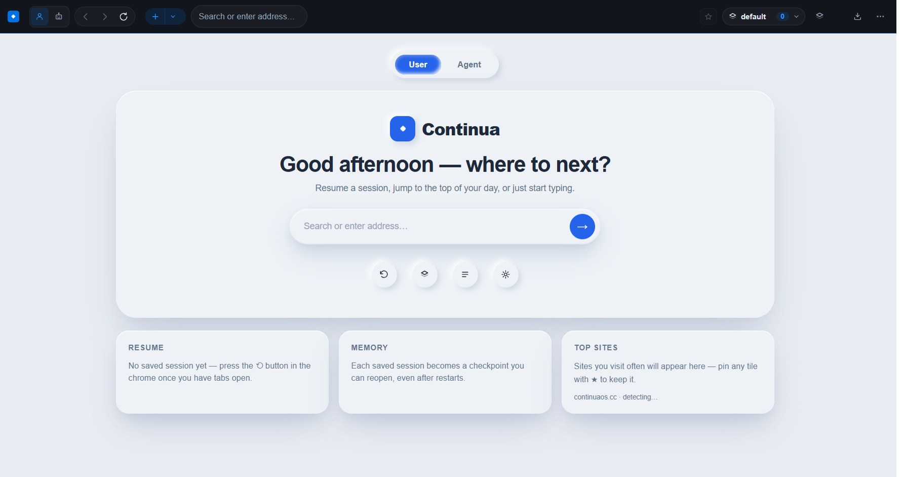
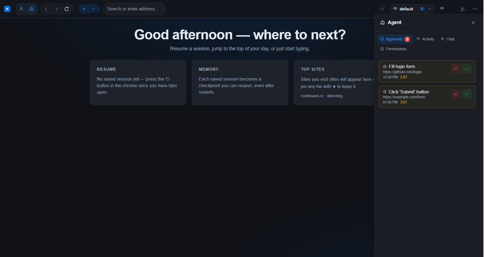

# Continua — The Persistent Context Protocol

> **"Pick up exactly where you left off. On any machine, in any tool, at any time."**

Continua is a **continuity browser** — an Electron + Chromium desktop app
where your entire browsing context (tabs, history, scroll positions,
workspaces, profiles) follows you across machines, over TLS to your own
Continua cloud. Local-first (no account needed to browse); no cloud AI
reads your tabs. See `docs/decisions/` for what each phrase means.

```
WHAT WE BUILD (product — all investment goes here):
apps/
  desktop-electron/ — Continua Browser (Electron + Chromium). THE PRODUCT:
                WebContentsView pool (6 live, LRU discard), per-profile
                isolation (Work ↔ Personal partitions + sharded stores),
                local-first continuity (SQLite FTS + Supabase delta sync),
                workspaces, downloads manager, reader, extensions autoload,
                onboarding. Run it: npm run dev:browser
  desktop/src/  — Shared React chrome UI (used by the product above).
  shell/        — Sync backend (Next.js + Supabase): /api/context,
                /api/devices, /api/connect, pairing pages, /download.
                No product UI investment (ADR-009; see ADR-004 history).

FROZEN (no investment — do not build on these):
  desktop/src-tauri/ — Legacy Tauri WebKitGTK host (Linux-lite fallback).
  packages/sdk/       — Plugin SDK (archived, no importers).
  chrome-extension/   — REDUNDANT Context Bridge (MV3): kept only because
                      the backend download route zips it. No investment.
  cloudflare-worker/  — ARCHIVED edge proxy (unused; shell /api/proxy wins).
docs/
  decisions/ — Architecture Decision Records. START HERE. ADR-009 is the
               latest ground truth (shell backend-only).
```

## Download

- Linux **AppImage** (v0.1.0, legacy Tauri build) + install guide: the
  **Download** page (`/download`, manifest-driven).
- Fresh **Chromium** builds (AppImage/deb/dmg/nsis) are published to
  **GitHub Releases** on every `v*` tag via the `browser` release job.
- From source: `npm install && npm run build:browser-chrome && npm run dev:browser`.

## What the browser does today

- **Chromium-compatible, nobody's surveillance** — the whole Chrome extension
  ecosystem, Widevine DRM, codecs and site compatibility (we *are* Electron),
  with on-device storage, shields default-on, and no account required to browse.
- **Tabs that stay alive** — pooled Chromium views (6 live, LRU discard to
  metadata); switching live tabs is instant, discarded tabs rehydrate
  swap-on-ready (no white flash).
- **Continuity without the tax** — local-first session (autosave + snapshots),
  delta sync to your Continua cloud over TLS, merge-on-pull (never destructive),
  profiles (Work ↔ Personal: separate cookies, history, extensions), workspaces,
  memory timeline, durable recently-closed ring, per-tab back-history + scroll +
  zoom + **container** resurrection across restarts.
- **Contexts that stay separate** — container tabs (Firefox-style identities,
  one persistent partition each, so cookies and storage never cross), E2E-encrypted
  password sync via a sync key that never leaves the machine in plaintext.
- **An agent boundary you can audit** (ADR-012) — an agent (MCP client, script,
  any local harness) may *read* any tab freely. Every *write* requires a
  human-issued, action-bound, single-use grant; page content can never approve;
  credential ops are user-only. Every decision, allowed or denied, lands in an
   append-only hash-chained log you can verify and export
   (**Managers → Agent audit**). This is the product's wedge — see
   `docs/STRATEGY.md`. The chrome has **User and Agent states**: User is the
   full browser; Agent adds a side panel with the approval queue, activity
   log, agent chat and permissions.
- **Daily-driver kit** — command palette (Ctrl+K) with local Tidy-tabs
  intelligence (on-device group suggestions, duplicates, sleeping tabs with
  wake-on-click, per-tab memory), shields (on-device blocklist, default on),
  one-click Web Store installs, omnibox suggestions,
  find-in-page, reader mode, per-tab zoom + mute badges, vertical tab rail,
  screenshot (Ctrl+Shift+S), print/PDF, downloads manager (pause/resume,
  Save-As), history search, Chrome/Firefox import (bookmarks, history,
  passwords), password generator, extensions autoload, onboarding.

The 12 "mediums" (keyword search, closed ring, per-site cookies, installed web
apps, screenshots, read-aloud, task manager, snapshots, tab search, bookmark and
history managers, detect/translate) are **parity maintenance**: they stay, they
get no new investment. See `docs/STRATEGY.md` for what does.

## Screenshots

User state — full browser chrome with the new start page:



Agent state — approval queue, activity log, agent chat and permissions beside the page:



## Quick start

```bash
npm install            # installs all workspaces (legacy-peer-deps in .npmrc)

# Continua Browser (the product — Electron + Chromium)
npm run dev:browser     # launch the browser
npm run build:browser-chrome  # build the React chrome (apps/desktop/dist)
npm run test:browser    # 165 host unit tests (pool, sync, policy, audit log…)
npm run check:package   # every host module is in the installer's file list
npm run check:host      # syntax gate + tests + packaging guard (what CI runs)

# Legacy Tauri host (frozen lite fallback)
npm run dev:desktop
npm run build:desktop
npm run test:desktop    # Rust unit tests (cargo test)

# Sync backend (no product UI)
npm run dev:shell
npm run build:shell
```

Linux build deps: `webkit2gtk` (+ `libayatana-appindicator` for tray).

## Status & direction

- Engine: Electron Chromium is the product (ADR-008). Tauri WebKitGTK is a
  frozen Linux-lite fallback. Continuity is TLS + Supabase RLS; password sync
  is separately E2E-encrypted with a local sync key (ADR/H7).
- Direction and what we refuse to build: **`docs/STRATEGY.md`** (read before
  proposing a feature). Latest decision: **ADR-012** — the agent trust boundary.
- Design system: Apple (designmd.supply) — see `apps/desktop/DESIGN.md`.
- Deliberately *not* planned: a GPUI/Rust chrome rewrite (two toolkits cannot
  own one window; ADR-008 stands — rationale recorded in `docs/STRATEGY.md`),
  and consumer monetisation of the browser.

All decisions and their rationale: **`docs/decisions/`**. Plan documents
marked SUPERSEDED are historical records, not direction.
What's left and what's blocking: **`ROADMAP.md`**.

## Notes

- The desktop app is fully self-contained (`apps/desktop` has its own Vite +
  Tauri config). Its Rust backend lives in `apps/desktop/src-tauri`.
- The shell's deployment config (`vercel.json`, `.vercelignore`, Dockerfile)
  lives inside `apps/shell`. On Vercel, set the **Root Directory** to
  `apps/shell`.
